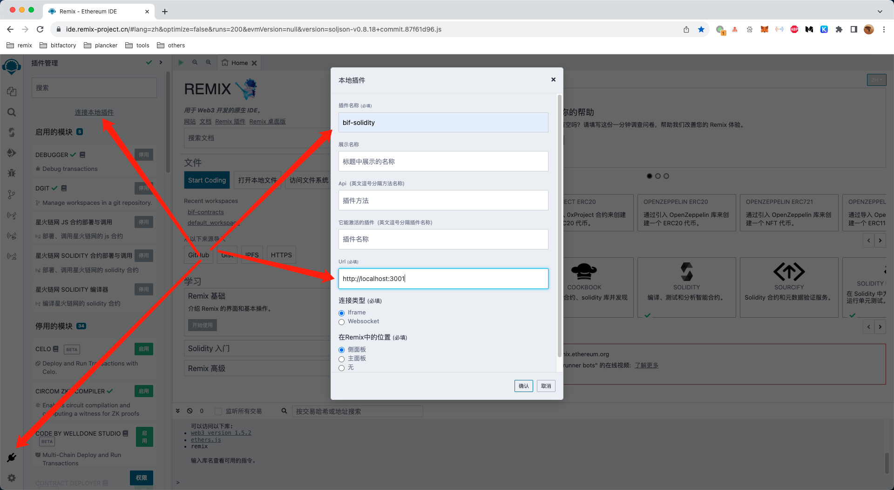

## 项目简介

这是星火链网 Remix 插件仓库，目前有三个插件

- Solidity 编译器
- Solidity 部署与调用
- JS 部署与调用

## 开发环境

```bash
// 安装依赖
yarn

// 启动开发环境
yarn serve:solidity
yarn serve:udapp
yarn serve:udapp-js
```

开发环境启动后，打开 Remix IDE ，点击左下角进入插件管理，点击`连接本地插件`，然后输入插件名称和 Url。


各插件的名称和 Url 如下

- Solidity 编译器：`bif-solidity`，`http://localhost:3001`
- Solidity 部署与调用：`bif-udapp`，`http://localhost:3001`
- JS 部署与调用：`bif-udapp-js`，`http://localhost:3001`

## 生成环境

```bash
// 构建生产环境
yarn build:solidity
yarn build:udapp
yarn build:udapp-js
```

生产环境构建成功后，各插件的静态文件目录如下

- Solidity 编译器：`dist/apps/solidity-compiler`
- Solidity 部署与调用：`dist/apps/udapp`
- JS 部署与调用：`dist/apps/udapp-js`

将这些目录上传到服务器，然后配置 nginx 。nginx 配置示例如下

- [Solidity 编译器](apps/solidity-compiler/nginx.conf)
- [Solidity 部署与调用](apps/udapp/nginx.conf)
- [JS 部署与调用](apps/udapp-js/nginx.conf)

## 提交插件

如果想在 Remix 官方站点使用这些插件，需要向 Remix 提交插件信息，可参考[别人提交的 PR](https://github.com/ethereum/remix-plugins-directory/pulls)

各插件信息如下

```json
[
  {
    "description": "编译星火链网的 solidity 合约",
    "displayName": "星火链网 Solidity 编译器",
    "events": [],
    "icon": "https://bif-solidity.remix-project.cn/assets/img/bif-solidity.webp",
    "location": "sidePanel",
    "methods": [],
    "name": "bif-solidity",
    "url": "https://bif-solidity.remix-project.cn/",
    "repo": "https://github.com/drafish/remix-bif-plugins",
    "documentation": "https://github.com/drafish/remix-bif-plugins/blob/main/apps/solidity-compiler/README.md",
    "maintainedBy": "drafish"
  },
  {
    "description": "部署、调用星火链网的 solidity 合约",
    "displayName": "星火链网 Solidity 合约部署与调用",
    "events": [],
    "icon": "https://bif-udapp.remix-project.cn/assets/img/bif-udapp.webp",
    "location": "sidePanel",
    "methods": [],
    "name": "bif-udapp",
    "url": "https://bif-udapp.remix-project.cn/",
    "repo": "https://github.com/drafish/remix-bif-plugins",
    "documentation": "https://github.com/drafish/remix-bif-plugins/blob/main/apps/udapp/README.md",
    "maintainedBy": "drafish"
  },
  {
    "description": "部署、调用星火链网的 js 合约",
    "displayName": "星火链网 JS 合约部署与调用",
    "events": [],
    "icon": "https://bif-udapp-js.remix-project.cn/assets/img/bif-udapp-js.webp",
    "location": "sidePanel",
    "methods": [],
    "name": "bif-udapp-js",
    "url": "https://bif-udapp-js.remix-project.cn/",
    "repo": "https://github.com/drafish/remix-bif-plugins",
    "documentation": "https://github.com/drafish/remix-bif-plugins/blob/main/apps/udapp-js/README.md",
    "maintainedBy": "drafish"
  }
]
```
