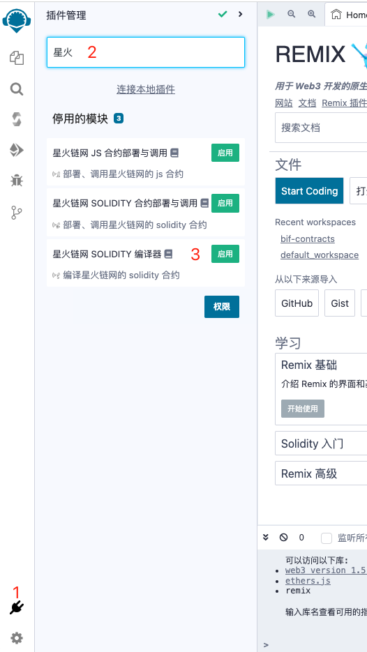
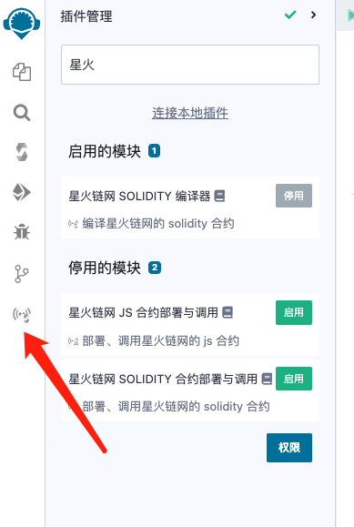
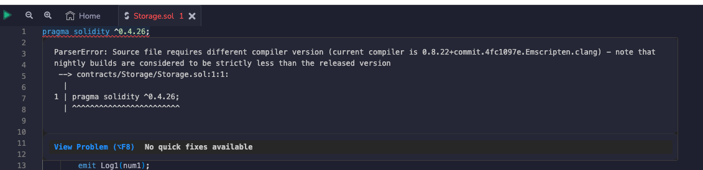
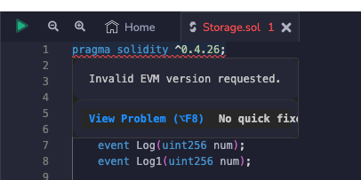

## 星火链网 Solidity 编译器

1. 点击左下角插件管理，进入插件管理模块
2. 在输入框中输入星火
3. 启用插件

点击插件图标即可进入插件功能界面。该插件源码是复制了 Remix 原生功能模块的代码，操作方式与 Remix 原生功能模块完全一致。有些功能还没有调通，暂时没有开放出来。界面上展示出来的这些功能是已经测试通过了的。具体操作方式可参考 Remix 官方文档 -- https://remix-docs.learnblockchain.cn/compile.html

### 编辑器中的错误说明

大家可能会在编辑器内看到这种错误，见下图

出现这种错误是因为 remix 本身自带的编译器版本和合约文件中指定的编译器版本不匹配。你用 remix 自带的编译器编译一下这个合约文件，这样 remix 自带的编译器版本就会切换到匹配的版本。这样这个错误就消失了。

大家还可能碰到另一个错误，见下图

这个经我测试，是 remix 本身的 bug 。等 remix 官方修复这个 bug 后就不会出现这个错误了。

最后说明一下，编辑器中的这两个错误并不会影响星火链网 Solidity 编译器的使用。
