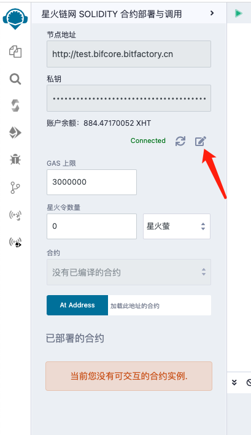

## 星火链网 JS 合约部署与调用

懒得看文档的朋友直接看教学视频吧 -- https://www.bilibili.com/video/BV1uQ4y1g7CH


1. 点击左下角插件管理，进入插件管理模块
2. 在输入框中输入星火
3. 启用插件

**注意：** 该插件需依赖星火链网 Solidity 编译器，使用之前请激活星火链网 Solidity 编译器


点击插件图标即可进入插件功能界面。


1. 输入节点地址
2. 输入私钥
3. 点击报错



**注意：** 保存后如需修改，请点击编辑按钮

该插件源码是复制了 Remix 原生功能模块的代码，操作方式与 Remix 原生功能模块大致上是一致的。有些功能还没有调通，暂时没有开放出来。界面上展示出来的这些功能是已经测试通过了的。具体操作方式可参考 Remix 官方文档 -- https://remix-docs.learnblockchain.cn/run.html

### 带 abi 部署

JS 合约没有 abi ，如果想获得像 Solidity 那样操作体验，那就需要用户自己定义 abi 。


如图所示，自定义一个 `.jsi` 后缀的文件（其实就是个 json），里面有三个字段

1. file 表示 js 合约文件路径
2. name 表示合约名称
3. abi 表示合约接口

具体 abi 该怎么定义，这里给个例子，简单说明一下。我也说不了太细，有些细节我自己也没想清楚。

```json
[
  {
    "constant": false, // 这个字段应该没啥用，可以不写，但我没测过。query 方法写 false ，init 和 main 都写 true
    "inputs": [
      // 这个字段定义输入参数
      {
        "name": "num", // 参数名随便怎么定义都行
        "type": "number" // 参数类型需要注意三种类型，数字类型写 number ，数字数组写 number[] ，json 字符串写 json 。这三个类型是在代码里有逻辑判断的，必须这么写，其他类型随意了，就只是界面上看看的，无所谓
      }
    ],
    "name": "store", // 这是方法名称
    "outputs": [], // 写方法没有返回值，这里填空数组就可以了
    "payable": false, // 这个字段应该也没啥用，可以不写，但我没测过。用于表示该方法是否可接受转账区块链的原生货币。先都写 false 吧。
    "stateMutability": "nonpayable", // 这个字段定义方法是 main 还是 query ，main 方法填 nonpayable ，query 方法填 view
    "type": "function" // main 和 query 方法都填 function
  },
  {
    "constant": true,
    "inputs": [
      {
        "name": "num",
        "type": "number"
      }
    ],
    "name": "retrieve",
    "outputs": [
      // 这个字段定义 query 方法的返回参数类型，具体定义参考前面的 inputs
      {
        "name": "",
        "type": "number"
      }
    ],
    "payable": false,
    "stateMutability": "view",
    "type": "function"
  },
  {
    "inputs": [
      {
        "name": "num",
        "type": "number"
      },
      {
        "name": "num1",
        "type": "number"
      }
    ],
    "payable": false,
    "stateMutability": "nonpayable",
    "type": "constructor" // init 方法填 constructor
  }
]
```

另外，可参考 -- [星火链网合约示例](https://github.com/caict-4iot-dev/bif-contracts)，这里有大量的 jsi 示例。

准备好 jsi 文件后，确保该文件在编辑器中出于选中状态。后面的操作就和 Solidity 都一样了。

**合约代码的编写有一定的限制**

JS 合约本质上只有三个方法

1. init 对应 solidity 的 **constructor**
2. main 对应 solidity 的 **写函数**
3. query 对应 solidity 的 **读函数**

如果想实现多个 **读** 或 **写** 函数，一般是传这样一个 json 字符串

```json
{
  "method": "store",
  "params": {
    "num": 1
  }
}
```

`method` 表示方法名，`params` 表示参数。

JS 合约有一个问题，就是太灵活了，字段名可以随意起。你也可以用 `function` 表示方法名，`arguments` 表示参数。只要合约代码能和这些字段名对上就可以。

但是，插件无法处理这种随意的情况。所以在插件代码中就写死了 `method` 表示方法名，`params` 表示参数。用户如果想带 abi 部署，就必须按照这个规范来写合约代码。

**另外，init 方法有点特殊。** 因为不需要 `method` ，所以 json 定义的更简单一点，直接写参数就可以了。

```json
{
  "num": 1,
  "num1": 2
}
```

如果不想受这种限制，可以采用不带 abi 的部署方式

### 不带 abi 部署


如上图所示，打开一个 js 合约文件。部署、调用都差不多，只不过参数只有一个，就是一个 json 字符串

**注意：** 这种不带 abi 的部署方式，是必须要传参的。如果碰到没有参数的情况，就直接传一个空对象 -- `"{}"`

### json 字符串限制

如果要传 json 字符串的话，一定要记得把双引号都替换成单引号。插件用的是 Remix 的代码，Remix 原生功能模块也是这么传参的。

可在浏览器开发者工具的 `Console` 中做字符串处理，下面是示例

```js
JSON.stringify({
  method: 'store',
  params: {
    num: 1,
  },
}).replaceAll('"', "'")
```


