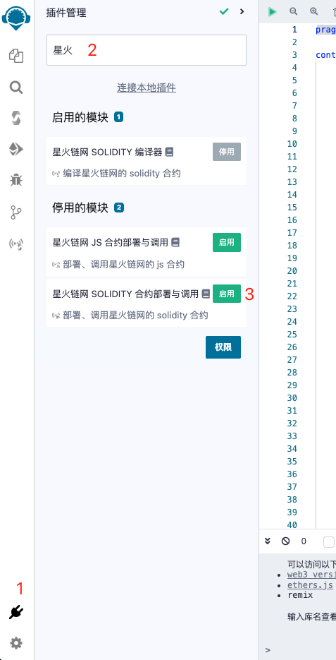
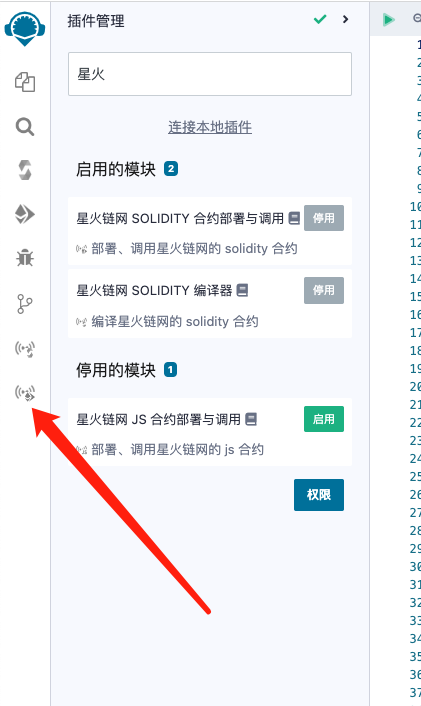
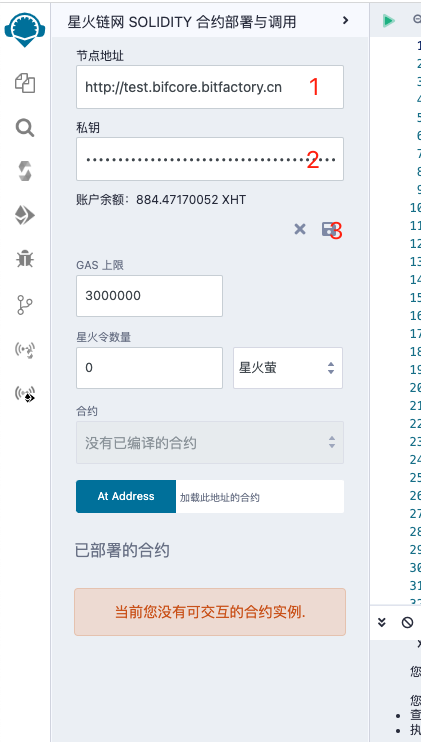
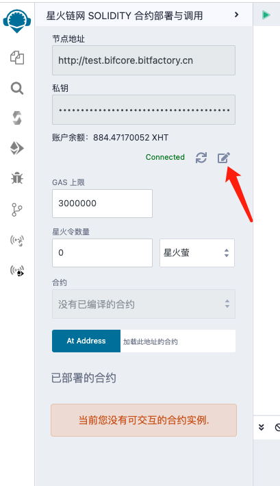
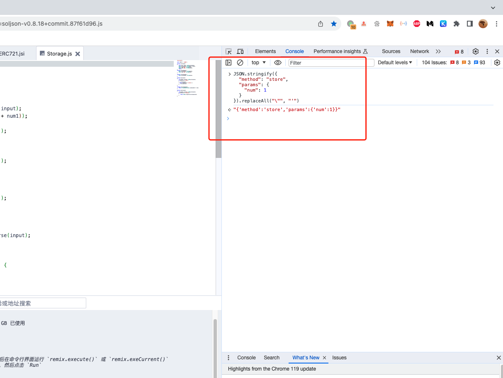
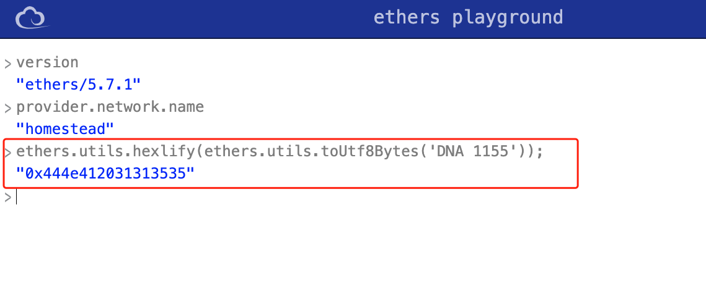

## 星火链网 Solidity 合约部署与调用

懒得看文档的朋友直接看教学视频吧 -- https://www.bilibili.com/video/BV1Ni4y1h7Yw



1. 点击左下角插件管理，进入插件管理模块
2. 在输入框中输入星火
3. 启用插件

**注意：** 该插件需依赖星火链网 Solidity 编译器，使用之前请激活星火链网 Solidity 编译器


点击插件图标即可进入插件功能界面。



1. 输入节点地址
2. 输入私钥
3. 点击报错



**注意：** 保存后如需修改，请点击编辑按钮

该插件源码是复制了 Remix 原生功能模块的代码，操作方式与 Remix 原生功能模块基本一致。有些功能还没有调通，暂时没有开放出来。界面上展示出来的这些功能是已经测试通过了的。具体操作方式可参考 Remix 官方文档 -- https://remix-docs.learnblockchain.cn/run.html

### json 字符串限制

如果要传 json 字符串的话，一定要记得把双引号都替换成单引号。插件用的是 Remix 的代码，Remix 原生功能模块也是这么传参的。

可在浏览器开发者工具的 `Console` 中做字符串处理，下面是示例

```js
JSON.stringify({
  method: 'store',
  params: {
    num: 1,
  },
}).replaceAll('"', "'")
```



### bytes 限制

如果要传 bytes 的话，一定要记得先转成 HEX 。插件用的是 Remix 的代码，Remix 原生功能模块也是这么传参的。

可以到这个网站做参数转换 -- https://playground.ethers.org/

```js
ethers.utils.hexlify(ethers.utils.toUtf8Bytes('DNA 1155'))
```


